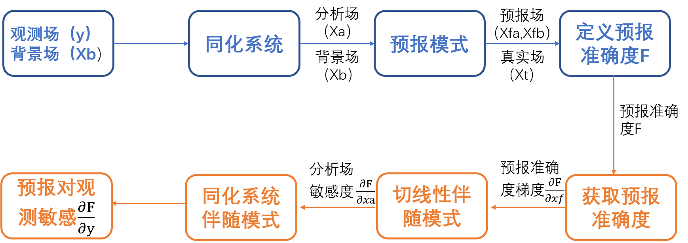

系统技术方案
============

WRF（Weather Research And Forecast Model) FSO系统包括预报模式（WRF）及其伴随（WRFPLUS）、变分数据同化系统（WRFDA）和诊断、绘图工具。该系统框架和流程如下：

* 观测场与背景场进入WRFDA得到分析场，从分析场和背景场出发，分别进行相同时效的非线性前向预报。

* 计算两组预报场与真实场的预报误差。根据这两组预报误差的差异定义预报准确度F（通常为干总能量）。

* 计算预报准确度对预报场（分别来自背景场和分析场）的梯度，利用伴随模式 :code:`WRFPLUS` 分别进行两次反向积分，得到预报误差对分析变量的敏感度。

* 预报误差对分析变量的敏感性结果作为输入场，进入WRFDA的伴随模式，计算预报误差对观测的敏感性，它涉及观测算子的伴随、观测误差协方差及 :code:`Hessian` 矩阵的逆，在最小化过程中采取 :code:`Lanczos` 迭代方法获得。

