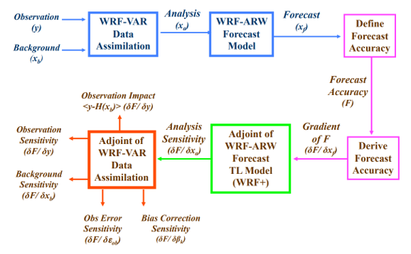

#######################
Welcome to FSO
#######################

在过去的二十年中，数据同化方案已经发展到非常复杂的系统，如在欧洲中期天气预报中心（ECMWF）运行的四维变分系统（4D-Var） 。该方案处理大量的空间和地基气象观测。它将观测结果与大气状态的先验（或背景）信息相结合，并使用全面的（线性化的）预测模型来确保观测在分析中得到动态的现实的和统计上可能的响应。对这样一个复杂的系统进行有效的性能监测已经成为绝对必要的，自由度为107度，每12小时同化周期有106个以上的观测值。每个观测对分析的贡献的评估是数据同化和数值天气预报中最具挑战性的诊断之一。数据同化方案中观测影响的方法已经被推导出来。这些技术显示了在同化过程中如何分配影响，哪些划分给予了观察，哪些划分给了背景或伪观察。因此，它们提供了模型和观测之间拟合的鲁棒性的指示，并允许对同化系统中分配的权重进行一些调整。近来，基于伴随的观测灵敏度技术已经被使用（Baker和Daley 2000，Langland和Baker 2004，Cardinali和Buizza，2004，Morneau等，2006，Xu和Langlang，2006，Zhu和Gelaro 2008）对预测的贡献，其中对代表短期预测误差的标量函数评估观测影响。一般而言，伴随方法可用于估计相对于同化系统重要性的任何参数的灵敏度测量。最近，Daescu（2008）根据主要输入参数：观测值，背景和它们的误差协方差矩阵，从一阶必要条件导出了无约束的变分资料同化系统的敏感性方程。本文提供了理论进一步诊断工具开发的框架不仅要评估观测对预测的影响，还要评估其他分析参数的影响。对背景协方差矩阵的敏感性有助于评估背景权重及其相关性的正确说明。协方差矩阵的局限性和弱点是众所周知的，有几个假设和简化来推导它们。 Desroziers和Ivanov（2001）和Chapnik等人（2006）讨论了诊断和调整数据同化方案中误差方差的重要性。在过去的几年中，观测系统实验（OSE）一直是预测系统中估计数据影响的传统工具。通常，通过从同化系统中去除观测子集来执行OSE，并将预测与包括所有观测的对照实验进行比较。通过比较不同统计方法获得的预测技能，评估观测值在预测中的价值，并且需要进行相当长时间（几个月）的若干独立实验以确保结果具有统计显着性。如果对GOS（全球观测系统）的不同组成部分进行全面调查，那么对给定观测类型的价值的评估可能会变得非常昂贵。显然，基于伴随的观测技术和OSE技术之间存在一些基本差异：

   
基于伴随观测灵敏度技术测量的是整个观测数据集出现在同化系统中时的观测影响，而观测系统在OSE上下文中进行了修正。实际上，每个OSE实验在同化观测方面都与其他实验不同。基于伴随观测灵敏度技术测量单个预测度量对观测系统所有扰动的响应，而OSE测量单个扰动对所有预测度量的影响。基于伴随的技术受到切线性假设的限制，有效期长达3天。此外，通常使用简化的伴随模型来将预测误差信息向后传递，这进一步限制了线性假设的有效性，并因此将诊断的使用限制在典型的24-48小时的预测范围内。使用简化的伴随模型的一个含意是，如果传播的反向信号较弱，则伴随整合所获得的分析不确定性可能是不正确的。另一方面，OSE可以衡量数据对远程预测的影响。基于伴随观测灵敏度技术测量在单一分析时间被同化的所有观测值的影响，而OSE包括之前被同化的观测值的影响，因为他们比较了修正的卡尔曼增益矩阵。本文的目的是双重的：说明在操作环境中可以用基于伴随的观测灵敏度进行的调查和诊断的类型，并提供系统中的整体观察性能。在这方面，伴随工具是基于最近在ECMWF进行的那些OSE的控制实验的预测误差以及最后实施的操作模型的预测误差。本文中，估计对观测值的预测敏感度作为调查短期预报误差来源的诊断工具，并与观测系统实验进行定性对比在第2节中，预测敏感度（观测和背景）的理论背景，数值解和显示了来自观察的预测误差贡献的计算。此外，总结了调查中使用的OSE。结果在第3节中说明。第4节给出结论。

.. toctree::
	:hidden:
	:titlesonly:

	self
	requirements
	credits

