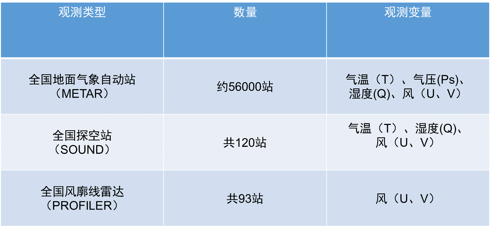

############
数据准备
############

FSO系统所需数据有观测数据、初始数据和真实场数据。目前已有的观测数据为中国观测站点资料，初始场和真实场均来自0.25°× 0.25°全球系统预报和分析资料（GFS）。

GFS数据
======================

至少需要每日UTC00时和UTC12时的GFS数据，且每个时刻至少存放该时刻分析场(*.f000)及其12、24、36、48、60（f012,f024,..,f060)时效的预报场。

GFS存放路径：/data1/raw/gfs/gfs.yyyymmddhh
 
.. code-block:: bash

    cd GFS_PATH
   
   > gfs.2018080112  gfs.2018080200  gfs.2018080212 gfs.2018080300

    cd gfs.2018080112
   
   > gfs.t00Z.pgrb2.0p25.f000   gfs.t00Z.pgrb2.0p25.f012  gfs.t00Z.pgrb2.0p25.f024  
     gfs.t00Z.pgrb2.0p25.f036   gfs.t00Z.pgrb2.0p25.f048  gfs.t00Z.pgrb2.0p25.f060
     
观测数据
======================
目前已有的观测资料包括：

   
1.观测资料获取
-------------------------------

观测资料都采用crontab定时获取。

1.1 地面观测资料

.. code-block:: bash

     > */15 * * * * bash -c "python3.6 get-metar.py --root-dir /home/data/raw/cimiss --time $(date -u +\%Y\%m\%d\%H\%M --date '-30 minute')" 1> /dev/null
     
资料以xml文件存储，每１５分钟一个文件：
     
 .. figure:: ../images/metar-get.png
   :align: center
   

1.2 探空资料

.. code-block:: bash

     > 20 8,20 * * * bash -c "python3.6 get-sounding.py --root-dir /home/data/raw/cimiss --time $(date -u +\%Y\%m\%d\%H\%M --date '-20 minute')" 1> /dev/null
     
探空资料以xml文件存储，每12小时一个文件:
     
 .. figure:: ../images/sound-get.png
   :align: center
   
 1.3 风廓线雷达资料
.. code-block:: bash

     > */15 * * * * bash -c "source python3.6 get-profiler.py --root-dir /home/data/raw/profiler --date $(date -u +\%Y\%m\%d\%H\%M --date '-30 minute')" 1> /dev/null
     
风廓线资料以txt文件存储，每15分钟一个文件：
 
 .. figure:: ../images/profiler-get.png
   :align: center
     
2.资料转LITTLE_R格式
-------------------------------

观测数据需存储为WRFDA可识别的little_r格式ob.ascii或prebufr格式ob.bufr。

.. code-block:: bash

    > 0 12,00 * * * bash -c "python3.6 /home/data/raw/little_r/convert_cimiss_2_littler.py"
    
观测数据存放路径：/data1/input/little_r/yyyymmddhh

.. code-block:: bash

   cd OBDATA_PATH
   
   > 2018080112 2018082000 2018080212 2018080300
   
   cd 2018080112
   
   > ob.ascii
  

 
   
   

