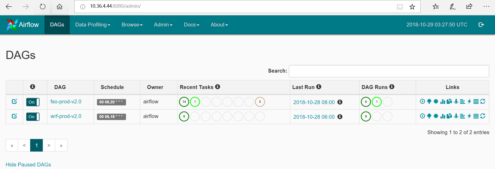

#################
加载DASs
#################

python语言的Airflow流程管理软件，对实时运行的FSO作业进行管理。针对每个作业编写DAG（定向非循环图）配置脚本，设置各个任务以及任务间的执行依赖关系。Airflow后台运行程序包括：

1. 调度器（Scheduler），负责在指定时间运行作业。
#. 管理页面后端服务器（Webserver），负责向前端（浏览器）提供HTML服务。

将所有准备好的DAG的python文件放到Airflow指定的目录中（由airflow.cfg的dags_folder指定）:

.. code :：

    dell@dell-Precision-Tower-7810:~$ cd airflow/dags/
    dell@dell-Precision-Tower-7810:~/airflow/dags$ pwd
    /home/dell/airflow/dags
    dell@dell-Precision-Tower-7810:~/airflow/dags$ ls -la
    total 44
    drwxrwxr-x 3 dell dell 4096 2月   6 02:08 .
    drwxrwxr-x 4 dell dell 4096 2月   3 07:12 ..
    -rwxrwxr-x 1 dell dell 3745 2月   4 05:58 fso-prod-00Z-v1.0.py
    -rwxrwxr-x 1 dell dell 3745 2月   4 05:58 fso-prod-12Z-v1.0.py
    drwxr-xr-x 2 dell dell 4096 2月   4 05:59 __pycache__
    -rwxrwxr-x 1 dell dell 3766 2月   4 05:59 west-fso-prod-00Z-v1.0.py
    -rwxrwxr-x 1 dell dell 3766 2月   4 05:59 west-fso-prod-12Z-v1.0.py
    -rwxrwxr-x 1 dell dell 3064 2月   2 05:18 west-prod-00Z-v1.0.py
    -rwxrwxr-x 1 dell dell 3064 2月   2 05:18 west-prod-12Z-v1.0.py
    -rwxrwxr-x 1 dell dell 3045 1月  30 00:22 wrf-prod-00Z-v1.0.py
    -rwxrwxr-x 1 dell dell 3045 1月  30 01:27 wrf-prod-12Z-v1.0.py

通过在运行机器上访问http://localhost:8081/admin链接可以查看所有在运行的作业列表。其中DAG列显示的是作业名称，如wrf-prod-12Z-v1.0，点击可以进入作业详情页面；Schedule列显示的是作业运行时间，如10 12 * * *表示12时的10分运行，Recent Tasks列显示作业运行状态，以不同颜色表示不同运行状态，如深绿色表示已经完成的作业数，浅绿色是正在运行的任务数，灰色是等待执行的任务数，红色表示出错的任务数，通过点击相应颜色的按钮可以进入查看任务；Last Run列可以查看最近运行时间；Links列提供一些快捷的操作按钮。

