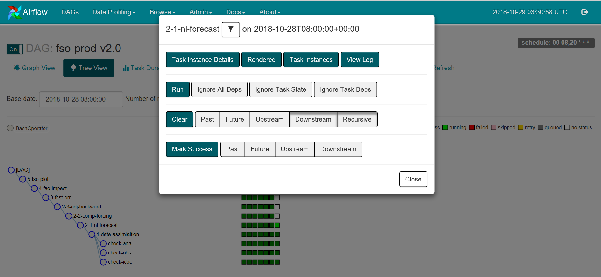

################################
FSO系统网页监控
################################

采用基于Python语言的Airflow流程管理软件，对实时运行的FSO作业进行管理。针对每个作业编写DAG（定向非循环图）配置脚本，设置各个任务以及任务间的执行依赖关系。通过在运行机器上访问10.36.4.44:8080/admin链接可以查看当前运行的作业列表。其中DAG列显示的是作业名称，如fso-prod-00Z-v2.0，点击可以进入作业详情页面；Schedule列显示的是作业运行时间，如``00 06 * * *``表示每天06时的00分启动作业运行，Recent Tasks列显示作业运行状态，以不同颜色表示不同运行状态，如深绿色表示已经完成的作业数，浅绿色是正在运行的任务数，灰色是等待执行的任务数，红色表示出错的任务数，通过点击相应颜色的按钮可以进入查看任务；Last Run列可以查看最近运行时间；Links列提供一些快捷的操作按钮。

.. figure:: ../images/dags.png
   :align: center

   FSO系统作业管理页面

在上一页面中通过点击DAG列中的某一作业名称，可以进入该作业的详细信息查看页面。默认显示Tree View，左侧是展开的子任务，右侧每列小方块是不同时间运行的状态，可以看到最近运行的任务，深绿色表示作业正常结束，浅绿色表示正在运行，红色表示出错，黄色表示遇到问题准备重试，灰色表示在队列中。

   作业流程的树状结构图

点击上图中的Graph View视图，可以显示作业中各个任务间的依赖关系图，可以清晰地看出任务流程，其中任务框的颜色同前表明任务的运行状态。通过点击某一任务框，显示进一步的操作选项对话框，如点击View Log按钮可以查看该任务的运行日志。当出现错误时可以查看错误原因，主要的错误是数据未就位。

   作业流程依赖关系图

   任务监控界面

   任务运行日志
