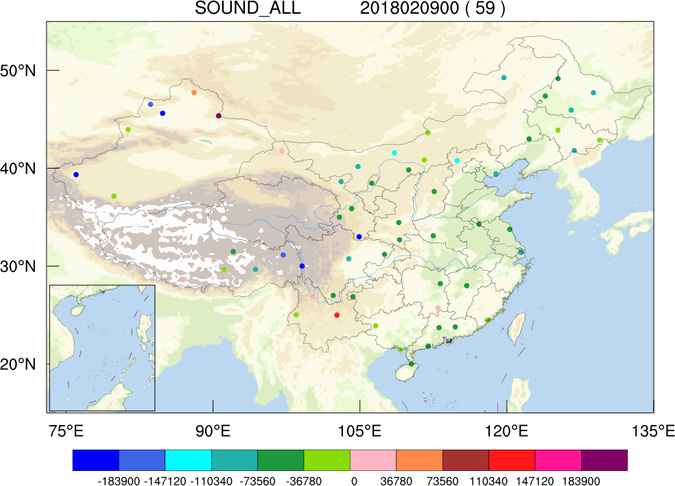
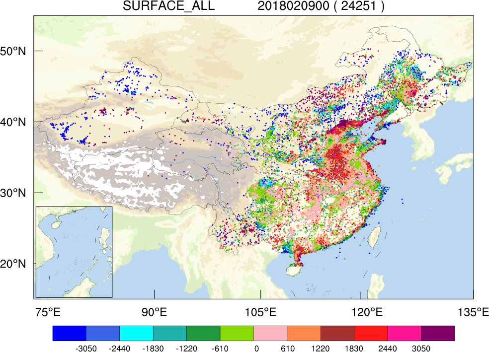
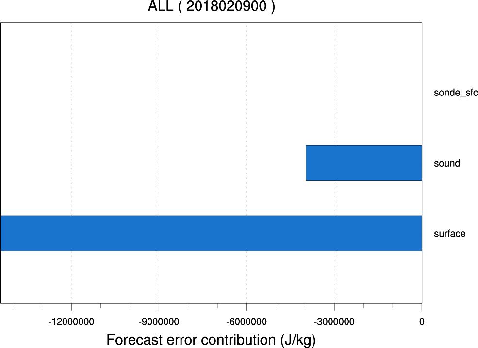
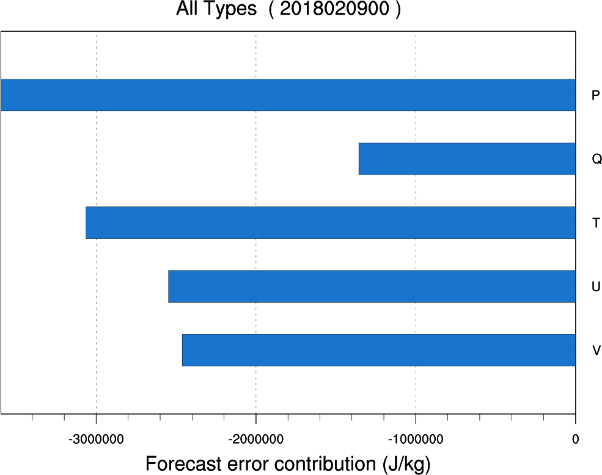
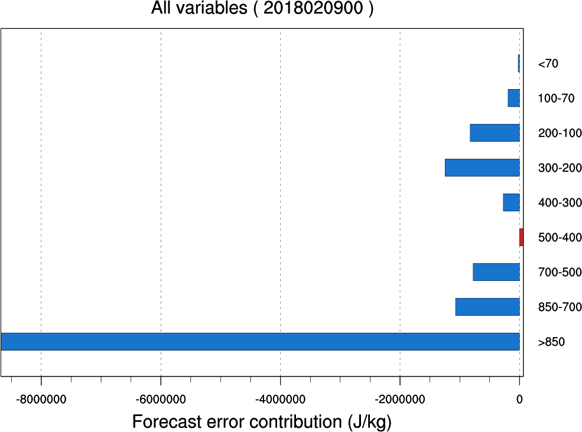
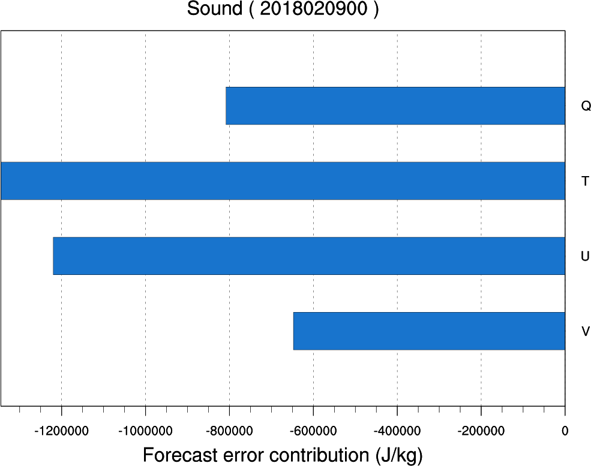
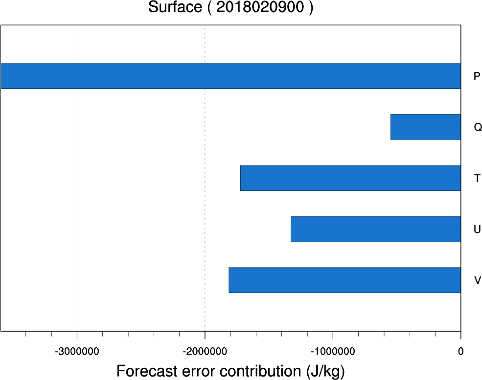

################
FSO结果后处理
################

gts_omb_oma_01结构说明
====================
FSO系统计算得到的预报误差对观测敏感性结果位于/home/FSO/china_FSO/run/ccyymmddhh/obsimpact/gts_omb_oma_01 文件中。以下图为例对当前gts_omb_oma_01数据结构作简要说明。

.. code:: bash

   vim gts_omb_oma_01
   >
   
metar
---------------------

.. code:: bash
       
      metar  站点个数  # 2个

      第一个站点提供的数据个数  #  1 地面自动站仅探测地面层数据，所以每个时刻都每个站点只有一个数据 

      数据序号 类型标识 纬度 经度 气压 观测变量u的观测值 u新息增量（O-B） 质控码（qc) u观测误差 u的贡献率 观测变量v的观测值 v新息增量（O-B） 质控码（qc) v观测误差 v的贡献率 观测变量t的观测值 t新息增量（O-B） 质控码（qc) t观测误差 t的贡献率 观测变量p的观测值 p新息增量（O-B） 质控码（qc) p观测误差 p的贡献率 观测变量q的观测值 q新息增量（O-B） 质控码（qc) q观测误差 q的贡献率  \# 一个站点的一个高度层数据为一行

      1     1SURF_   22.47   111.36  -888888.0000000       -1.0840874        0.0000000     -88        1.1000000        0.0000000        0.1864257        0.0000000     -88        1.1000000        0.0000000      299.2500000        0.0000000     -88        2.0000000        0.0000000  -888888.0000000        0.0000000     -88      100.0000000        0.0000000  -888888.0000000        0.0000000     -88  -888888.0000000        0.0000000
      
      第二个站点提供的数据个数  # 1 
     
      ....
      
*注：synop、ships 、buoy 、surface（包括metar) 、sonde_sfc、tamdar_sfc 数据格式相同*

sound
------------------

.. code:: bash

    sound 站点个数  # 1个

    第一个站点提供的数据个数  #5个 探测到5个不同高度层上的数据
    
    站点序号 同一站点数据序号 类型标识 纬度 经度 观测变量u的观测值 u新息增量（O-B） 质控码（qc) u观测误差 u的贡献率 观测变量v的观测值 v新息增量（O-B） 质控码（qc) v观测误差 v的贡献率 观测变量t的观测值 t新息增量（O-B） 质控码（qc) t观测误差 t的贡献率 观测变量p的观测值 p新息增量（O-B） 质控码（qc)  q观测误差 q的贡献率   # 一个站点的一个高度层数据为一行 探空数据观测变量为u、v、t、q

     1       1  UPA    36.73   101.75    77100.0000000       -1.6704050        0.0000000     -88        1.2200000        0.0000000       -1.0998851        0.0000000     -88        1.2200000        0.0000000      287.3500000        0.0000000     -88        1.0000000        0.0000000        0.0071498        0.0000000     -88        0.0018132        0.0000000
     
*注：sound、tamdar、airep数据格式相同*

profiler 
------------------------

.. code:: bash
    
    profiler 站点个数  # 1个

    第一个站点提供的数据个数  #2个 探测到2个不同高度层上的数据
    
    站点序号 同一站点数据序号 类型标识 纬度 经度 观测变量u的观测值 u新息增量（O-B） 质控码（qc) u观测误差 u的贡献率 观测变量v的观测值 v新息增量（O-B） 质控码（qc) v观测误差 v的贡献率  \#风廓线探测仅有u、v两种观测变量

    1       1  WND    20.00   110.15     1415.0000000       -9.0069802     -708.2427394       0        2.2000000       -6.3706098       10.1899120    -1873.6202283       0        2.2000000        9.7260098
    
*Note：pilot、profiler、geoamv、qscat、polaramv数据格式一致*  

数据库
=======================

为了便于FSO运行结果的统计与绘图，采用pythonPostgreSQL数据库的方式对数据进行存储与管理.可参考 /home/FSO/fso_2pg.py和/home/FSO/china_FSO/fsoplot/data2pg.ncl脚本。

数据库连接
------------------------

前台查看

.. code:: bash

    >psql -U dell -d fso

    >\dt    #列举所有数据表

    >\d tb_sound #列举tb_sound数据表结构

    >select * from tb_sound; #查看tb_sound数据表的具体内容，注意“;”不能少

    >drop table tb_sound;  #删除数据表，注意“;”不能少
    

从其他电脑登录数据库

psql -U dell -d fso -h 10.255.1.4 -p 5432 -w

后台连接

.. code:: bash

    #!/usr/bin/python
    import psycopg2
    conn = psycopg2.connect(database="fso",user="dell",password="fso2018",host="127.0.0.1",port="5432")

数据表说明
------------------------

####tb\_*

\* 代表观测类型，如tb\_surface。tb\_* 每条数据依次存放

id  time(时间） stnid(类型标识） lon(经度） 纬度（lat)

#####tb\_*data

\* 代表观测类型,如tb\_surfacedata。tb\_*data存放gts\_omb\_oma_01中各点具体数据，tb\_\*data与tb\_\*的id一致。每条数据依次存放：

id  var(观测变量)   lev(高度层)   pres(气压)   obs(观测值） inv(新息增量)  qc(质控码) error(观测误差) inv(贡献率)

绘图产品
====================

有了数据库对结果的管理，可直接读取数据库数据进行结果的统计，并传递到NCL绘图脚本中进行绘图。可参考/china_FSO/fsoplot/drawfso.py/等脚本。

绘图产品最终存放于/china_FSO/run/ccyymmddhh/fsoplot/目录中。

.. note:: 负值代表该观测减小预报误差;正值代表该观测增加预报误差

   探空观测对12小时预报误差的贡献

   地面观测对12小时预报误差的贡献

   观测类型对12小时预报误差的贡献

   变量类型对12小时预报误差的贡献

   不同层次观测对12小时预报误差的贡献

   探空观测的不同观测变量对12小时预报误差的贡献

   地面观测的不同观测变量对12小时预报误差的贡献
