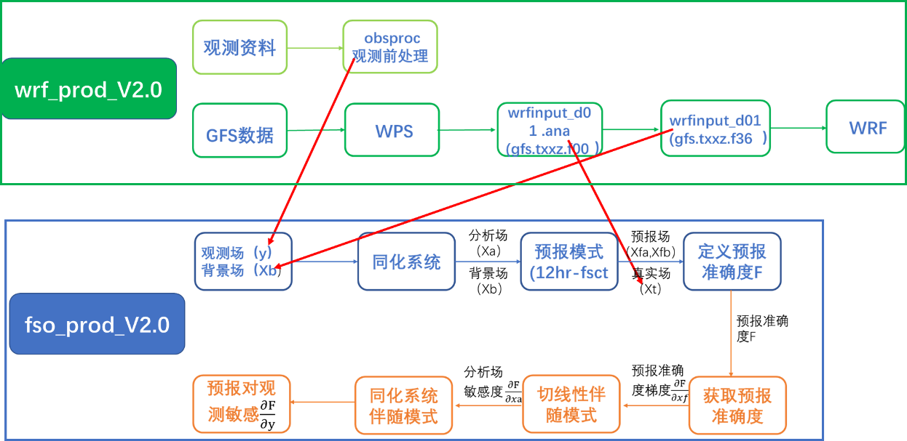

#####################
FSO运行流程
#####################

FSO由两个DAG共同完成：wrf-prod-v2.0与fso-prod-v2.0。

wrf-prod-v2.0：为fso-prod-v2.0准备初始场、真实场及观测数据，由wrf-prod-v2.0.py脚本控制。

fso-prod-v2.0：执行FSO、结果输出及绘图，由fso-prod-v2.0.py脚本控制。

二者关系
======================

   

wrf-prod-v2.0
======================
 
每天运行2次，分别准备UTC00时和UTC12时的背景场及观测数据。每一步骤对应一个外部python脚本。

- wrf_check-gfs

检测运行时刻GFS资料是否到位(gfs.\*.f012,gfs.\*.f012,...,gfs.\*.f060)

- wrf_obsproc

检测观测资料是否已到位；进行观测资料前处理，得到ob.ascii,存放在china_FSO/ob/路径下。

- wps-prod

运行wps

- real-ana-prod

由该时刻GFS分析场(gfs.*.f000)得到wrfinput_d01.ana,用作计算预报误差的真实场，存放在china_FSO/rc/路径下。

- real-icbc-prod

将GFS-36小时预报场(gfs.*.f036)用作同化系统的背景场wrfinput_d01,存放于china_FSO/rc/。

- wrf-prod

以real-icbc-prod得到的wrfinput_d01作为初始场，向前预报24小时，长时间的计算结果可用于统计背景误差协方差等

fso-prod-v2.0
======================

- check-obs, check-icbc, check-ana

检查观测ob.ascii、同化背景场wrfinput_d01、真实场wrfinput_d01.ana是否生成。

- 1-data-assimialtion
 
三维变分同化，得到分析场wrfvar_output,保存为china_FSO/fc/wrfinput_d01。

- 2-1-nl-forecast

分别从Xa，Xb开始进行非线性积分12小时得到预报场Xfa,Xfb

- 2-2-comp-forcing

计算预报误差以及预报误差对预报变量的梯度

- 2-3-adj-backward

将预报误差对预报变量的梯度作为伴随模式的初值，反向积分得到预报误差对Xa、Xb的梯度。

- 3-fcst-err

根据两次伴随结果，计算预报误差对分析变量的敏感性。

- 4-fso-impact

把预报误差对分析变量的敏感性作为输入，利用WRFDA伴随求得预报误差对观测的敏感性。

- 5-fso-plot

采用数据库方式存储和分类统计观测贡献率，并用于绘图。
