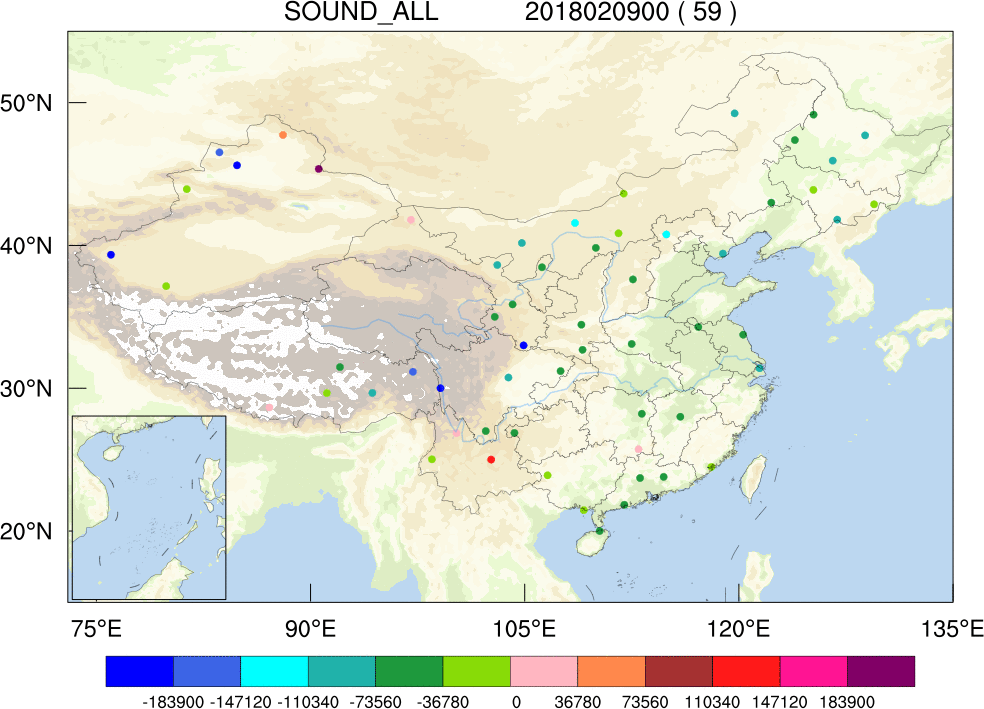

FSO（Forecast sensitivity to observation）即预报对观测的敏感性，最初由MMM / NCAR开发，是一种基于伴随理论的用于评估观测对同化系统和数值预报贡献的方法，或者说，观测对预测误差减少的影响。

本手册介绍的是为中国气象局气象探测中心搭建的一套预报误差对观测的敏感性分析系统(FSO)，更新至v2.0版本，产品包括全国15公里分辨率逐12小时的预报误差对观测的敏感性分析。系统采用Singularity Docker容器技术对FSO软件进行了封装，以便于系统移植与管理。同时采用Python Airflow流程管理软件对整个业务作业进行可视化管理。该系统能实时监测观测系统、数值预报和同化系统，并为观测系统的调整、观测数据来源的评估提供依据。

.. toctree::
	:hidden:
	:titlesonly:

	self
	requirements
	credits

